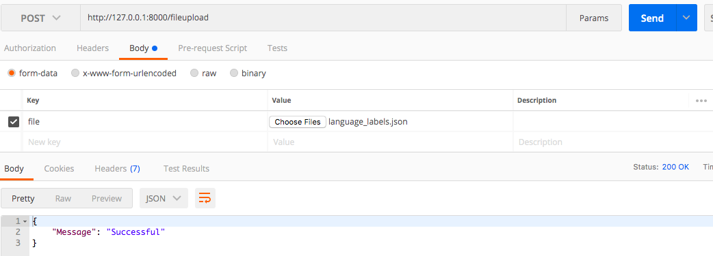

# Django-Rest-Celery

## Setup
Run `docker-compose up`

## Details
### Endpoints:
There 3 endpoints:

* upload file - `[Post] /fileupload` currenly only support files similiar to the json files provided

* list and create new entry in model `[GET, POST] api/webapp/<model_name>`

* retrieve/update/delete a entry in model `[GET, PUT, DELETE] api/webapp/<model_name>/<id>`

There 3 periodic celery task:

The timings and codes are located at `webapp/tasks.py`
* randomly increment a total_docs - `randomly_increment_total_docs()`
* calculate the number of files uploaded - `calc_total_files()`
* update the files by periodically writing the DB items to the respective files. - `write_objs_to_files()`